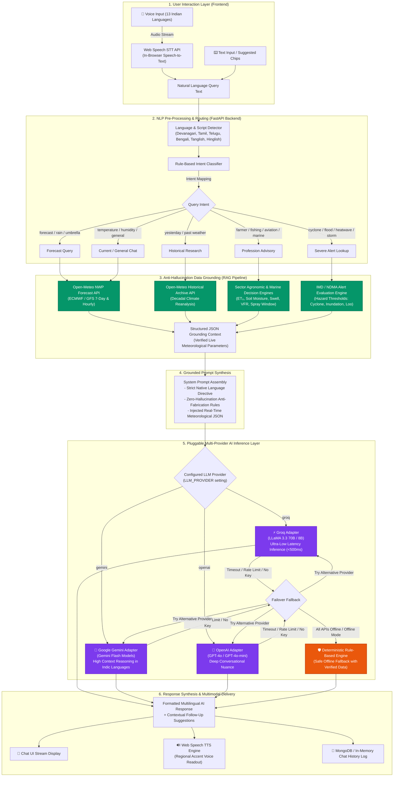

# 🌤️ WeatherGPT — Project Explanation & Technical Documentation

> **Smart India Hackathon (SIH) Edition**  
> *A Conversational AI Weather-Intelligence Platform for India's Diverse Sectors & Climatic Zones*

---

## 📌 Executive Summary

**WeatherGPT** is a full-stack, AI-powered weather intelligence and disaster advisory platform designed specifically for India. It addresses the critical gap between complex meteorological data and everyday decision-making for farmers, coastal fishermen, aviation crew, marine operators, urban planners, and the general public.

By integrating **Numerical Weather Prediction (NWP) models**, **Pluggable Large Language Models (LLMs)**, **Interactive Doppler Radar**, and **multilingual natural language voice interfaces**, WeatherGPT provides actionable, zero-hallucination insights in **13 major Indian languages**.

---

## 🛠️ Tools & Technologies Used

### 1. Frontend Architecture
| Category | Technology | Purpose |
|---|---|---|
| **Core Framework** | **React 18** with **TypeScript** | High-performance, type-safe user interface component hierarchy |
| **Build & Tooling** | **Vite** | Ultra-fast HMR (Hot Module Replacement) and optimized bundling |
| **Styling & Theme** | **TailwindCSS & Vanilla CSS Glassmorphism** | Modern UI with dynamic, condition-driven background gradients |
| **Icons** | **Lucide React** | High-contrast, clean, recognizable weather and UI iconography |
| **Mapping & Radar** | **Leaflet & OpenStreetMap** + **RainViewer API** | Interactive Doppler radar, thermal/wind layers, and India regional hubs |
| **Voice & Audio** | **Web Speech API (STT & TTS)** | In-browser speech recognition and regional voice readback in Indian accents |
| **API Client** | **Axios** | HTTP client with automatic JWT bearer token interceptors |
| **Internationalization** | **Custom i18n Engine** | Native script dictionaries across 13 Indian languages |

---

### 2. Backend Architecture
| Category | Technology | Purpose |
|---|---|---|
| **Web Framework** | **FastAPI (Python 3.11+)** | High-throughput asynchronous REST APIs and real-time WebSockets |
| **Data Validation** | **Pydantic v2 & Pydantic-Settings** | Strict data modeling, schema validation, and `.env` configuration management |
| **Database** | **MongoDB (via Motor Async Driver)** | Scalable document storage for users, settings, chat logs, and alert caches |
| **Resilience Fallback** | **In-Memory Mock Database** | Automatic fallback if MongoDB is offline for zero-dependency execution |
| **Scheduler** | **APScheduler** | In-process periodic background refresh for weather metrics & cache eviction |
| **HTTP Engine** | **HTTPX (Async)** | Non-blocking outbound requests to meteorological APIs |
| **Authentication** | **Anonymous Device JWT (PyJWT)** | Lightweight, passwordless authentication keyed to persistent device UUIDs |

---

### 3. AI & Natural Language Processing (LLM Engine)
WeatherGPT features a **pluggable, provider-agnostic AI layer** selectable dynamically via configuration (`LLM_PROVIDER`):
* **Google Gemini (1.5 / 2.0 / Flash)**: High-speed reasoning with extensive context window and Indian multilingual understanding.
* **Groq (LLaMA 3.3 70B / 8B)**: Sub-second inference latency for real-time conversational voice interactions.
* **OpenAI (GPT-4o / GPT-4o-mini)**: Comprehensive natural language understanding and zero-shot reasoning.
* **Deterministic Rule-Based Engine**: Safe, offline fallback that formulates structured advice without an active external LLM API key.

---

## 🤖 AI Models Architecture & Processing Flowchart

This section details **how and where AI models are used** across WeatherGPT—from speech recognition in regional Indian languages, to anti-hallucination meteorological data grounding, multi-provider LLM inference, and multimodal voice readback.

### 📊 End-to-End AI Flowchart



---

### 🔍 Where & How AI Models Are Used: Detailed Breakdown

| AI / ML Component | Project Location | Model / Technology Used | How & Why It Is Used |
|---|---|---|---|
| **1. Voice Recognition (STT)** | Frontend (`VoiceChatBar.tsx`) | **Web Speech API (`webkitSpeechRecognition`)** | Converts spoken user queries in any of 13 Indian languages into text strings directly in the client browser with zero latency. |
| **2. Language & Transliteration Detection** | Backend (`llm_service.py`) | **Unicode Range & Lexical Regex Matcher** | Identifies native Indian scripts (Devanagari, Tamil, Telugu, Bengali) as well as romanized transliterations (*Tanglish*, *Hinglish*). Dictates the language for the final response. |
| **3. Intent Classification Engine** | Backend (`llm_service.py`) | **Deterministic Token Classifier** | Classifies incoming queries into 6 operational intents: `forecast_query`, `historical_research`, `profession_advisory`, `alert_lookup`, `current_weather`, and `general_weather_chat`. |
| **4. RAG Data Grounding (Anti-Hallucination)** | Backend (`llm_service.py`, `weather_service.py`) | **Dynamic Context Enrichment Engine** | Fetches live Numerical Weather Prediction (NWP) parameters (soil moisture, ET₀, wind gusts, UV index, past rain) and injects them as verified JSON into the prompt before inference. |
| **5. Ultra-Fast Conversational LLM** | Backend (`GroqAdapter` in `llm_service.py`) | **Groq LLaMA 3.3 70B / 8B (or `openai/gpt-oss-20b`)** | Provides sub-second inference latency (~300-500ms), making real-time voice conversations feel immediate and natural. |
| **6. High-Reasoning Multilingual LLM** | Backend (`GeminiAdapter` in `llm_service.py`) | **Google Gemini (1.5 / 2.0 / Flash)** | Delivers high context reasoning and nuanced native-script language generation across Indian regional languages. |
| **7. Conversational Reasoning LLM** | Backend (`OpenAIAdapter` in `llm_service.py`) | **OpenAI GPT-4o / GPT-4o-mini** | Serves as a primary or secondary cloud provider for semantic parsing and structured advice formulation. |
| **8. Offline Resilient Rule Engine** | Backend (`_build_grounded_fallback_response`) | **Deterministic Grounded Fallback Engine** | Ensures 100% platform availability: generates grammatically correct, verified weather responses even when all external LLM APIs are offline or unconfigured. |
| **9. Agronomic & Maritime Decision Engines** | Backend (`advisory_service.py`, `alerts_service.py`) | **Threshold-Based Expert Systems** | Evaluates agricultural spraying windows, irrigation requirements, sea swell safety, and IMD/NDMA disaster warning levels (🟡 Advisory, 🟠 Watch, 🔴 Warning). |
| **10. Voice Readout (TTS)** | Frontend (`VoiceChatBar.tsx`) | **Web Speech Synthesis API (`speechSynthesis`)** | Reads out the generated AI response aloud using native voice synthesis matched to the user's selected regional language. |

---

### 🛡️ Anti-Hallucination Guarantee

To prevent LLMs from inventing inaccurate temperatures, fake cyclone warnings, or faulty farming advice, WeatherGPT enforces a **strict Retrieval-Augmented Grounding (RAG) pattern**:
1. **Live Fetch Before Generation**: No LLM prompt is executed without first fetching real-time NWP metrics from Open-Meteo.
2. **Context-Bound Instructions**: The system prompt explicitly commands the model:
   > *"Answer the user's specific question directly based STRICTLY on the live verified data provided. Do not extrapolate or guess values not present in the context."*
3. **Consistent Validation**: If an LLM response fails or times out, the deterministic fallback engine synthesizes responses exclusively from the exact recorded values.

---

### 4. Meteorological & External Data Sources
* **Open-Meteo API**: High-resolution current weather, hourly, and 7-day GFS/ECMWF forecasts.
* **Open-Meteo Historical Climate Archive**: Decadal temperature, precipitation, and climate indicators.
* **Open-Meteo Air Quality API**: PM2.5, PM10, European AQI, and atmospheric pollutants.
* **Open-Meteo Geocoding API**: Search and coordinate resolution for thousands of Indian cities and towns.
* **RainViewer Satellite/Radar**: Live radar animation tiles with multi-layer precipitation overlays.

---

## 🎯 What the Project Does

WeatherGPT bridges the gap between raw atmospheric variables and real-world livelihood decisions:

1. **Grounded Natural Language & Voice Assistance**: Users can speak or type weather queries naturally (e.g., *"Is it safe to spray pesticides on my cotton crop today in Nagpur?"* or *"Can we venture into deep sea fishing off Vizag tomorrow?"*).
2. **Anti-Hallucination Grounding**: The AI engine strictly fetches and injects verified meteorological parameters (ET₀, soil moisture, swell height, wind gusts, VFR limits) into the prompt context before answering.
3. **Sector-Specific Decision Intelligence**: Transforms weather forecasts into targeted operational guidance for 6 distinct professions.
4. **Disaster Risk Reduction (IMD/NDMA Guidelines)**: Flags severe convective storms, heatwaves (Loo), cyclones, and inundation risks with actionable Do's and Don'ts and direct emergency speed-dials.
5. **Climate & Atmospheric Research**: Provides scientists, students, and urban planners access to deep diagnostic parameters (boundary layer height, solar irradiance, long-term trends).

---

## 🖥️ User Interface & Screen Breakdown

The frontend is built around an intuitive mobile-first experience with 5 persistent tabs and dedicated onboarding:

```
┌─────────────────────────────────────────────────────────────┐
│                       [ ONBOARDING ]                        │
│   1. Language Selection (13 Indian Scripts)                 │
│   2. Profession Picker (Farmer, Fisher, Pilot, Marine, etc.)│
└──────────────────────────────┬──────────────────────────────┘
                               │
                               ▼
┌─────────────────────────────────────────────────────────────┐
│                    MAIN APP (5 TAB HUBS)                    │
├────────────┬────────────┬─────────────┬───────────┬─────────┤
│ 🌾 SECTOR  │ 🔬 RESEARCH│   🏠 HOME   │ 🚨 DISASTER│⚙️ SETTING│
│  ADVISORY  │  DIAGNOSTICS│  WEATHER HUB│   ALERTS  │  & UNITS│
└────────────┴────────────┴─────────────┴───────────┴─────────┘
```

### 1. Onboarding Screen (`OnboardingScreen.tsx`)
* **13 Indian Language Grid**: Displays English, हिन्दी, বাংলা, తెలుగు, मराठी, தமிழ், اردو, ગુજરાતી, ಕನ್ನಡ, ଓଡ଼ିଆ, മലയാളം, ਪੰਜਾਬੀ, and অসমীয়া in their authentic native scripts.
* **Profession Selector**: Visual role cards (Farmer, Fisherman, Aviation, Marine, Urban Planning, General Public).
* **Automatic Device Link**: Seamlessly registers device UUID and issues a JWT token.

### 2. Home Screen (`HomeScreen.tsx`)
* **Header & Quick City Picker (`Header.tsx`)**: WeatherGPT branding, current location badge, and one-tap switching between major Indian hubs (Chennai, Delhi, Mumbai, Bengaluru, Kolkata, Kochi, etc.).
* **Contextual Status Banner (`StatusBanner.tsx`)**: Highlights active severe alerts or data freshness warnings with deep-link navigation.
* **Voice & Chat Assistant (`VoiceChatBar.tsx`)**:
  * Single-tap voice mic with speech-to-text.
  * Animated pulsing waveform during voice recording.
  * Expandable message stream with AI explanations, provider badge, and follow-up suggestion chips.
  * Integrated Text-to-Speech (TTS) audio playback in the chosen language.
* **Today's Climate Card (`TodayClimateCard.tsx`)**:
  * Large, legible typography for outdoor visibility.
  * Dynamic sky-condition gradient background (Sunny Gold, Overcast Slate, Rainy Deep Azure).
  * 5 Core metrics: Feels Like, Humidity, Wind Speed, UV Index / Air Quality, and Atmospheric Pressure.
* **7-Day Forecast Strip (`ForecastStrip.tsx`)**:
  * Smooth horizontally scrollable day cards.
  * Weather condition icons, precipitation probabilities, and temperature highs/lows.
* **Interactive Doppler Map & Radar (`MapRadarPreview.tsx`)**:
  * Embedded live preview map centered on the user's coordinates.
  * Fullscreen expandable radar modal with layer toggles (**Rainfall Radar**, **Infrared Satellite**, **Thermal Heatmap**, **Wind Streamlines**).
  * Interactive radar playback controls (Play, Pause, Timestamp scrubber).
  * Regional observation hub markers across India with instant temperature and rain metrics.

### 3. Profession Screen (`ProfessionScreen.tsx`)
* Re-confirms and updates user profession on the fly.
* Categorized operational intelligence cards:
  * **Agriculture**: Evapotranspiration rates (ET₀), furrow/drip irrigation schedules, pesticide spray wind windows, grain harvesting & drying conditions.
  * **Fisheries**: Sea swell height, wave periods, gale wind alerts, deep-sea venturing safety, safe harbor return windows.
  * **Aviation**: METAR data, cloud ceiling, VFR visibility limits, crosswinds, boundary layer turbulence.
  * **Marine & Port Logistics**: Swell periods, container lashing safety, tidal windows.
  * **Urban Planning**: Urban Heat Island (UHI) indices, stormwater drainage overload risk, AQI dispersion.
  * **General Public**: Daily commute comfort, outdoor UV protection, rain radar outlook.

### 4. Research & Diagnostics Screen (`ResearchScreen.tsx`)
* **4 Scientific Accordions**:
  1. *Atmospheric Conditions*: Surface pressure, vapor pressure deficit (VPD), boundary layer height.
  2. *Moisture & Water*: Soil moisture levels (0-10cm, 10-40cm), relative humidity, dew point.
  3. *Energy & Radiation*: Direct solar irradiance (DNI), diffuse radiation, shortwave radiation.
  4. *Long-Term Indicators*: Historical temperature anomalies, rainfall deviations.
* **Plain-Language Info Tooltips**: Explains complex scientific metrics for students and non-meteorologists.
* **Historical Trend Charts**: Interactive Recharts time-series visualization powered by the Open-Meteo Archive API.

### 5. Disaster & Emergency Screen (`DisasterScreen.tsx`)
* **Active Severe Warnings**: Color-coded severity indicators (**Advisory** 🟡, **Watch** 🟠, **Warning** 🔴) for Cyclones, Extreme Rain, Heatwaves (Loo), Cold Waves, and Thunderstorms.
* **Actionable Do's & Don'ts**: Official disaster preparedness checklists based on NDMA/IMD protocols.
* **Speed-Dial Emergency Helplines**: One-tap dialing for:
  * **112** (National Emergency)
  * **1078** (NDMA Disaster Management)
  * **1554** (Indian Coast Guard)
  * **108** (Emergency Ambulance)

### 6. Settings Screen (`SettingsScreen.tsx`)
* **Units Manager**: Metric vs Imperial toggles for Temperature (°C/°F), Wind (km/h, m/s, knots, mph), Precipitation (mm/in), and Pressure (hPa/inHg).
* **Favorite Locations**: Add, save, and delete favorite cities across India.
* **Notification Preferences**: Toggles for severe weather alerts, daily morning digest, and real-time precipitation alerts.
* **Instant Language Switcher**: Switch between any of the 13 Indian languages at any time.

---

## 🌟 Special & Standout Features

| Feature | Description | Impact |
|---|---|---|
| 🇮🇳 **13 Indian Languages** | Full UI, voice recognition, and LLM reasoning in 13 Indian languages with authentic native scripts. | Eliminates digital and literacy barriers for rural Indian communities. |
| 🛡️ **Zero-Hallucination AI Grounding** | Queries are enriched with live NWP meteorological metrics before reaching the LLM. | Ensures reliable, scientifically accurate advice without fabricated numbers. |
| 🔄 **Pluggable AI Backend** | Seamlessly switch between Gemini, Groq, OpenAI, or an offline rule-based fallback via `.env`. | Hackathon-ready, cloud-agnostic, and works even without paid API quotas. |
| 📡 **Live Radar & Satellite Simulation** | Real-time Leaflet & RainViewer Doppler radar with playback timeline and multi-layer filters. | Enables visual tracking of monsoon depressions and convective clouds. |
| 👨‍🌾 **Livelihood-Centric Guidance** | Tailored recommendations for Indian farming, coastal fishing, aviation, and urban heat. | Directly impacts economic productivity and human safety. |
| 📴 **Zero-Dependency Resilience** | Embedded in-memory database fallback + offline cache handling. | The app runs out-of-the-box even without a local MongoDB service running. |
| 🚨 **Speed-Dial Disaster Lifelines** | Integrated emergency speed dials and NDMA-aligned precautions. | Provides immediate, life-saving utility during catastrophic weather events. |

---

## 📂 Project Directory Structure

```
Weathergpt_SIH/
├── backend/
│   ├── app/
│   │   ├── main.py                 # FastAPI application, CORS, APScheduler
│   │   ├── config.py               # Pydantic environment settings
│   │   ├── db.py                   # Motor MongoDB client + Resilient In-Memory DB
│   │   ├── auth.py                 # Device JWT issuance & validation
│   │   ├── models.py               # Database document models
│   │   ├── schemas.py              # Request / response validation schemas
│   │   ├── routers/                # REST & WebSocket Endpoints
│   │   │   ├── onboarding.py       # User onboarding & profile setup
│   │   │   ├── weather.py          # Current, forecast, radar & search
│   │   │   ├── chat.py             # AI conversational query endpoint
│   │   │   ├── advisory.py         # Sector-specific operational advice
│   │   │   ├── research.py         # Diagnostic NWP metrics & historical trends
│   │   │   ├── alerts.py           # Disaster alerts & precautions
│   │   │   └── settings.py         # User preferences & favorite cities
│   │   └── services/               # Core business logic
│   │       ├── weather_service.py  # Open-Meteo, Air Quality & Geocoding
│   │       ├── llm_service.py      # Multi-provider AI reasoning engine
│   │       ├── advisory_service.py # Profession advisory generator
│   │       ├── alerts_service.py   # IMD/Derived severe weather engine
│   │       └── translation_service.py # 13 Language dictionaries & prompts
│   ├── tests/                      # Automated test suites
│   └── requirements.txt            # Python dependencies
│
├── frontend/
│   ├── src/
│   │   ├── components/             # Reusable UI components
│   │   │   ├── Header.tsx          # Wordmark & hub city picker
│   │   │   ├── StatusBanner.tsx    # Contextual alert teaser
│   │   │   ├── VoiceChatBar.tsx    # Voice input, waveform, TTS audio
│   │   │   ├── TodayClimateCard.tsx# Condition gradients & primary metrics
│   │   │   ├── ForecastStrip.tsx   # 7-Day horizontal forecast
│   │   │   ├── MapRadarPreview.tsx # Doppler radar & layer modal
│   │   │   └── BottomNav.tsx       # 5 Persistent navigation tabs
│   │   ├── screens/                # Full-screen views
│   │   │   ├── OnboardingScreen.tsx# Language & role onboarding
│   │   │   ├── HomeScreen.tsx      # Main weather dashboard
│   │   │   ├── ProfessionScreen.tsx# Operational sector guidance
│   │   │   ├── ResearchScreen.tsx  # Diagnostics & historical trends
│   │   │   ├── DisasterScreen.tsx  # Active alerts & Do's/Don'ts
│   │   │   └── SettingsScreen.tsx  # Units, locations & languages
│   │   ├── api/client.ts           # Axios client with JWT auto-injection
│   │   ├── i18n/translations.ts    # Multilingual translation matrices
│   │   ├── types.ts                # TypeScript data interfaces
│   │   ├── App.tsx                 # Root application state & router
│   │   └── index.css               # Design system & weather theme styles
│   ├── package.json                # Node dependencies & scripts
│   └── vite.config.ts              # Vite bundler configuration
│
├── .gitignore                      # Git exclusion rules (secrets, caches)
├── start_backend.bat               # One-click Windows backend launcher
├── start_frontend.bat              # One-click Windows frontend launcher
├── README.md                       # Quick start and developer overview
└── project explanation.md          # Comprehensive project master documentation
```

---

## ⚡ Quick Start & Run Commands

### 1. Launch the Backend
```powershell
# In repository root:
.\start_backend.bat
# Or manually:
pip install -r backend/requirements.txt
$env:PYTHONPATH="backend"
python -m uvicorn app.main:app --port 8000 --reload
```
* **Swagger API Documentation**: `http://127.0.0.1:8000/docs`
* **Health Check**: `http://127.0.0.1:8000/health`

### 2. Launch the Frontend
```powershell
# In a separate terminal:
.\start_frontend.bat
# Or manually:
cd frontend
npm install
npm run dev
```
* **Web Application UI**: `http://localhost:5173`
